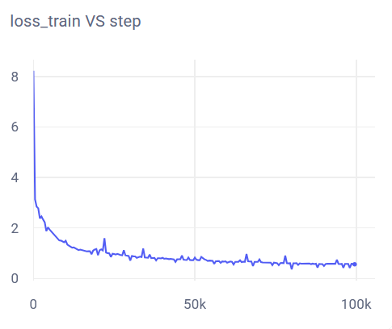
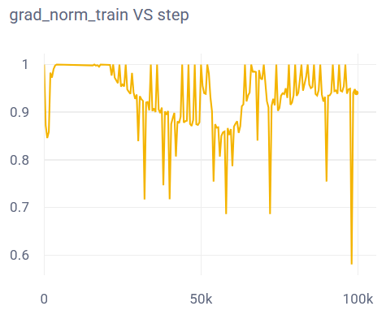

# Репорт ASR

## Архитектура модели
Для решения домашнего задания была реализована модели архитектуры [Conformer](https://arxiv.org/pdf/2005.08100), в частности, ее small версия на ~10 млн параметров. Архитектура модели была полностью воспроизведена в работе, за исключением Subsampling - в оригинальной работе Subsampling уменьшал исходную спектрограмму в 4 раза, в этой работе - в 2 раза. Сделано это было по причине проблем с CTCLoss - по каким-то причинам, длина выхода модели получалась меньше закодированного текста, что вело к бесконечному значению CTCLoss.

## Предобработка и аугментации
Для предобработки, как и в оригинальном Conformer использовались мел-спектрограммы с параметрами:
```yaml
sample_rate: 16000
n_fft: 400
hop_length: 160
n_mels: 80
f_min: 50
f_max: 8000
```
Также были применены несколько видов аугментаций для аудио:
- Gain
- Pitch
- Noise
- BandPassFilter

Их параметры можно найти в [конфиге для аугментаций](https://github.com/7embl4/asr/blob/main/src/configs/transforms/instance_transforms/wav_augs.yaml). Аугментации к спектрограммам не применялись.

## Данные для обучения
Для обучения использовалась часть датасета LibriSpeech - train-clean-100. В силу ограниченных ресурсов, использовалась лишь часть датасета: 2000 батчей из ~3500.

## Процесс обучения
Для воспроизведения тренировочного процесса следует использовать запустить train.py скрипт без каких-либо опций. Время обучения зависит от ресурсов, в моем случае, обучение длилось почти 19 часов на RTX 4070. Процесс тренировки был скопирован из работы про Conformer, однако, в силу меньших ресурсов и времени, некоторые параметры были подкорректированы.

## Эксперименты
Изначально планировалось обучать версию Conformer(M), но было выясненно, что данных и времени для обучения слишком мало. Кроме того, судя по результатам из оригинальной статьи, большой разницы в точности моделей нет (по крайней мере, для этой домашней работы). [CometML репорт](https://www.comet.com/7embl4/asr/avn1npn36etvl1rcaq9qovjs4lprtfk0?compareXAxis=step&experiment-tab=panels&prevPath=%2F7embl4%2Fasr%2Fview%2Fnew%2Fpanels&showOutliers=true&smoothing=0&xAxis=step).

Также были протестированы разные параметры LR Scheduler и в конечном итоге был использован OneCycleLR с параметрами
```yaml
max_lr: 1e-3
epochs: 50
steps_per_epoch: 2000
pct_start: 0.2
div_factor: 25
final_div_factor: 5000
anneal_strategy: cos
```

## Результаты
Обученная модель выдает следующие результаты на тестовых данных 
Метрика        | test-clean | test-other
---------------|------------|-------------
Argmax WER     |    40.04   |    67.2    
Argmax CER     |    13.46   |    30.73
BeamSearch WER |    39.57   |    65.03
BeamSearch CER |    12.67   |    29.09

По результатам видно, что CER сильно ниже WER, следовательно, модель ошибается в конкретных буквах, а не в словах целиком. Для исправления этого следует добавить BPE кодирование. 

 \
*График изменения функции ошибки*

Значение функции ошибки на последней эпохе: 0.562, что говорит о том, что обучение можно продолжать. В целом, по графику ошибки видно, что лосс падал во время всего обучения и не выходил на плато, что значит, что параметры обучения неплохие и для лучшего качества модели нужно лишь больше данных и времени. 

 \
*График нормы градиента*

График нормы градиента также указывает на то, что модель еще не сошлась к минимуму ошибки.